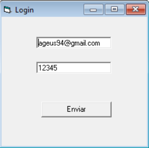
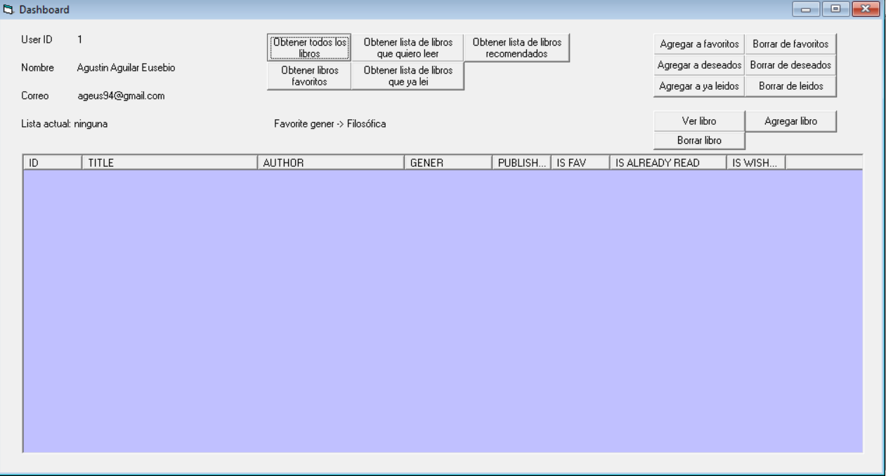
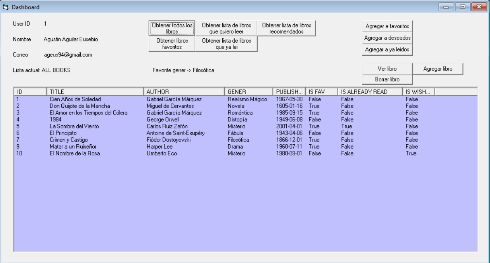
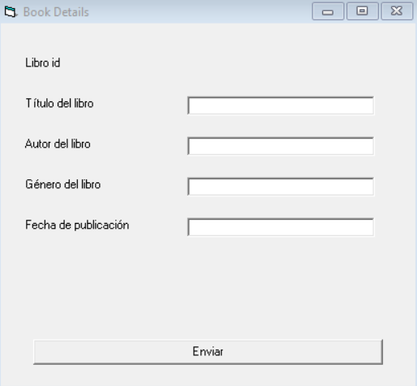
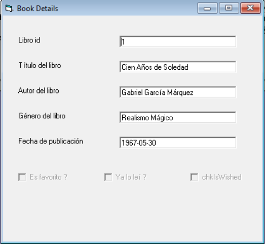
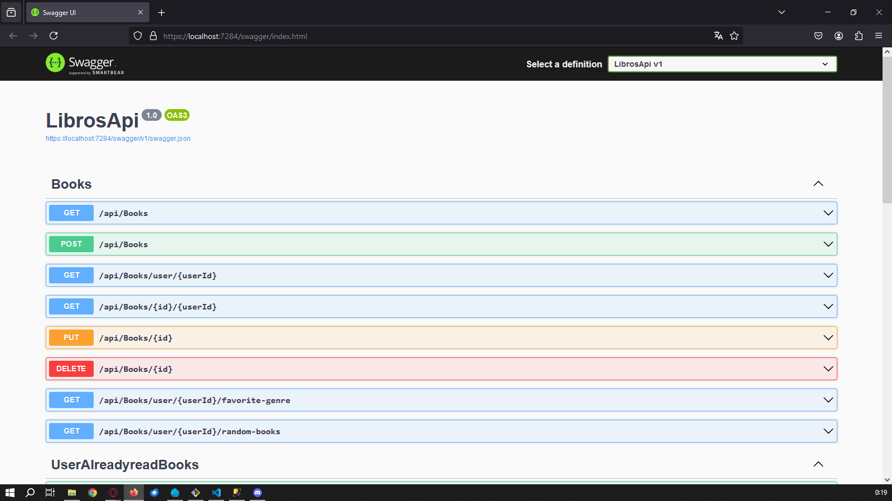
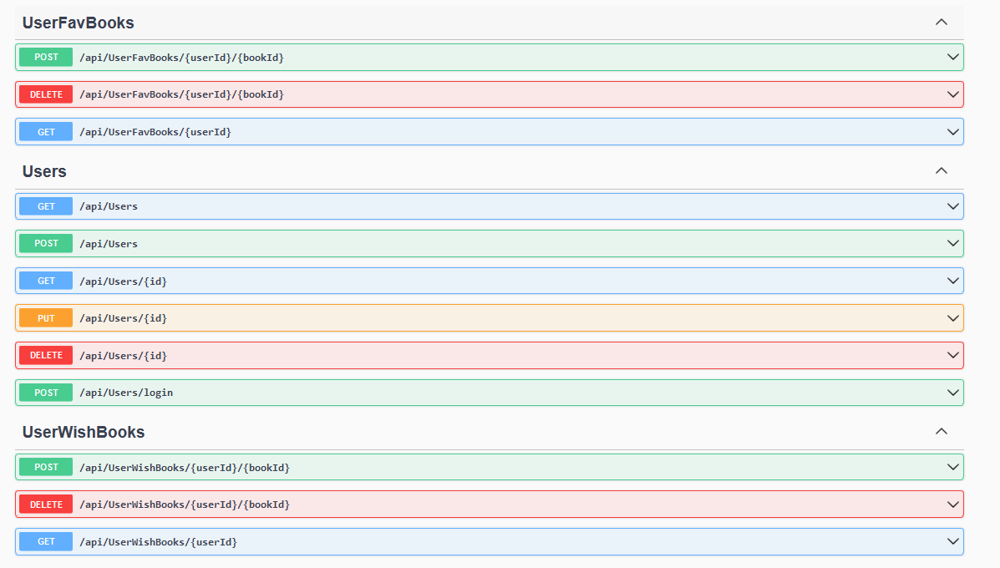

## BOOK HUB WITH, VISUAL BASIC 6 AND SQL SERVER

### Description  

Applications on Windows will always be necessary, and not only the ones that are built with new technologies, but also those that were made some time ago to satisfy clients' needs. Some technologies are old, but they performed their job well. VB6 is one of those technologies. In my particular case, I've always wanted to develop old, vintage desktop applications, and this was my opportunity.

In school, I used to work with VBA. Also, in the work environment, I used and still use VBA because almost every company works or has something to do with Excel, and VBA is embedded in this Office application, so I was somewhat familiar with this kind of technology.

### Objetive

We're going to develop a VB6 application for managing books in some kind of repository or hub for users. These users could have the possibility to add books to their favorites, their wished books, and their already-read books. Additionally, there will be other features, like knowing the user's favorite genre of books and a feature that recommends books that are in the hub.


### Contact / Name

Name -> Agustín Aguilar Eusebio

Gmail -> ageus94@gmail.com

Discord -> ageus94


### Some screenshots
Login



Dashboard



When I click on Obtner todos los libros



Add book view



See book view



Some swagger screensshots




### Prerequisites

- [.NET Core SDK](https://dotnet.microsoft.com/download)
- [Visual Basic 6 (VB6)](https://en.wikipedia.org/wiki/Visual_Basic_(classic)) (for running the VB6 application)
- SQL Server (or any other database compatible with Entity Framework Core)
- Postman or any API testing tool (optional, for testing API endpoints)

### Instructions

##### Step 1: Clone the Repository

```
git clone <your-repository-url>
cd <repository-directory>
```

#### Step 2: Add appsettings.json

Create an `appsettings.json` file in the root of the project directory with the following structure:

```
{
  "Logging": {
    "LogLevel": {
      "Default": "Information",
      "Microsoft.AspNetCore": "Warning"
    }
  },
  "AllowedHosts": "*",
  "ConnectionStrings": {
    "Connection": "Server=<YourServer>;Database=BookHub;User Id=<YourUserId>;Password=<YourPassword>;Encrypt=True;TrustServerCertificate=True"
  }
}
```
#### Step 3: Setup the Database

Open your terminal or command prompt, then run the following commands:

```
dotnet tool install --global dotnet-ef
dotnet ef database update
```

This will install the Entity Framework Core CLI tool and apply the migrations to create the BookHub database with the necessary tables.

#### Step 4: Run the API
Open Program.cs in your IDE.
Press `Ctrl + Shift + D` to select the HTTPS version.
Press `F5` to run the API.
The API should now be running on port `7284`. If it's running on a different port, update the port in your application code accordingly.

#### Step 5: Add a User
Use Swagger to insert a user into the system. Swagger should automatically open in your browser when you start the API.

#### Step 6: Run the VB6 Application
Open the VB6 project using Visual Basic 6 software.
Build and run the application.
Log in to the application.

#### Step 7: Use the Application
Add Books: Add new books to your library.
Manage Lists: Add books to your favorites, wished list, or already read list.
View Books: See the list of books and their details.
Get Recommendations: Request book recommendations based on your favorite genres.


### How it was made

Phase 1: Initial Development and Familiarization
I began the project by developing a simple login form and adding some basic forms to get familiar with the controls available in VB6. During this phase, I also experimented with data manipulation, storing records in a text file as a simulation of a database. This allowed me to create a basic CRUD (Create, Read, Update, Delete) system for books, which helped me get comfortable with displaying and handling data in the application.

Phase 2: Entity-Relationship Diagram and API Development
Once I was familiar with the controls and basic CRUD operations, I moved on to designing the entity-relationship diagram for the database. I started by sketching the diagram on paper, which was a straightforward process.

Next, I developed the API using C# and .NET, as these technologies were chosen for the project. The .NET framework provided convenient tools for creating controllers and managing migrations, making the database construction process efficient and manageable.

Phase 3: Integration with VB6 Application
After setting up the API, I integrated it with the VB6 project. I started with the login functionality, where the API handles authentication using email and password. When the login credentials match the records, the API returns the user ID, which is then used for further interactions within the application.

I created buttons in the VB6 application for various functionalities:

- Retrieving all books.
- Retrieving the user's favorite books.
- Retrieving books that have already been read.
- Retrieving books on the user's wishlist.
- Fetching a list of recommended books based on the user's favorite genre.
- Adding books to the favorites, read, or wishlist categories.
- Removing books from these lists.
- All these actions are based on the user ID to ensure that the data is user-specific. 
The "All Books" retrieval also includes information on whether a book is marked as a favorite, read, or wished for the current user.

Additionally, I added buttons to display a detailed form with book data. One button opens the form to view the details, and another (which displays the same form) allows the user to add a new book.

Data Handling Structure
For data handling, I used the following structure to manage records:

```
obj1.property1;obj1.property2|obj2.property1;obj2.property2
```

### Problems

I was not able to handle JSON responses. I mean, I was not able to import and use correctly third-party models to handle JSON.

When I passed the API to build and run from Visual Studio Code, because I developed it with Visual Studio, the ports were all messed up, and my URIs in the VB6 app were with another port.

### Entity-Relationship Diagram
Below is the Entity-Relationship Diagram (ERD) for the BookHub API, detailing the relationships between users, books, and their lists (favorites, already read, wished).


### Retrospective
#### What Did I Do Well?

Use API and make my own sistem for handeling the comunication between api and frontend (client) aplication

#### What Didn't Go Well?

Maybe use more tables and by consecuence adding more complkexity to the app, whrn the app is not a large app, so it took me more time to acomplish the developing process.

#### What Can I Do Better?
I could be better at making my API URIs and methods after planning these URIs and methods well. I started with CRUDs of entities, and there was boilerplate code that I didn't use in the application; it only confused me.

Have a variable or constant for the port, so I don't have to change it.
